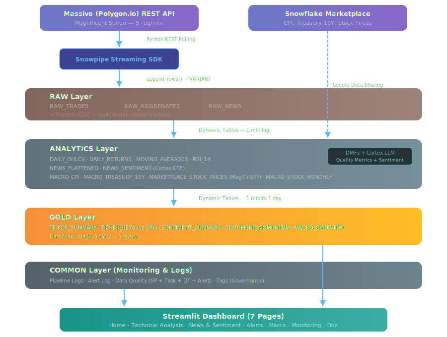
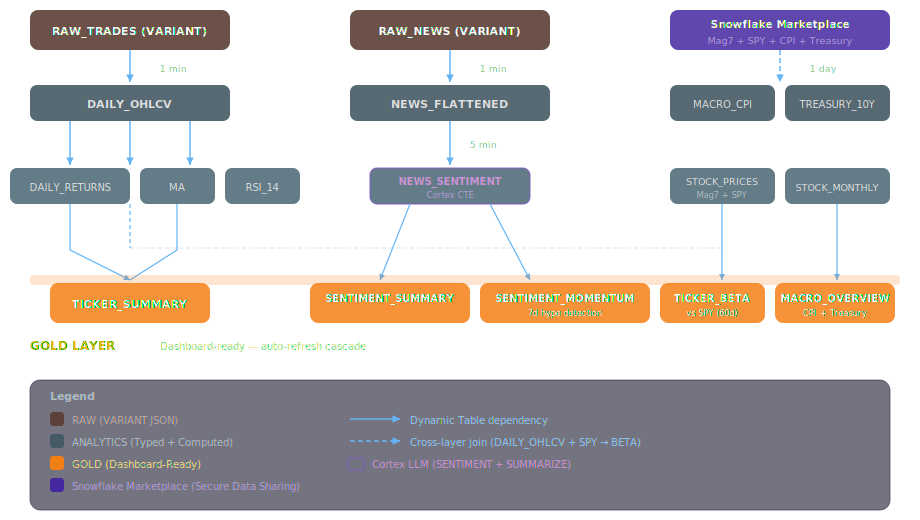

# ⚡ SnowPulse — Near-Real-Time Market Intelligence


> Near-Real-time market intelligence platform for the **Magnificent Seven** (AAPL, MSFT, GOOGL, AMZN, TSLA, NVDA, META) built 100% on **Snowflake native features**.

### 🚀 **[Try the Live Dashboard Here](https://snow-pulse.streamlit.app/)**

## 🎯 What This Project Demonstrates

| Snowflake Feature | Usage |
|---|---|
| **Snowpipe Streaming** | Near-Real-time ingestion from Massive (Polygon.io) REST API via Python SDK |
| **Dynamic Tables** | Declarative transformations with automatic cascade refresh (1 min lag) |
| **Snowflake Alerts** | Automated market + data quality monitoring |
| **Cortex LLM** | AI-powered sentiment analysis on financial news (SENTIMENT + SUMMARIZE), CTE-optimized |
| **Snowflake Marketplace** | Macro enrichment — CPI, Treasury 10Y, extended stock prices |
| **Data Metric Functions** | Automated quality metrics (negative prices, OHLCV violations, missing tickers) |
| **Tags** | Governance — classify tables by domain, layer, and freshness SLA |
| **Streams** | CDC (Change Data Capture) — append-only tracking on RAW tables |
| **Stored Procedure + Task** | 10 quality checks running every 60 minutes |
| **VARIANT** | Schema-on-read for semi-structured JSON market data |
| **External Access Integration** | Secure outbound API calls with Network Rules + Secrets |
| **RSA Key-pair Auth** | Passwordless authentication for Snowpipe Streaming SDK |

## 🏗️ Architecture

<p align="center">
  
</p>

## 📊 Dashboard Pages

| Page | Description |
|---|---|
| **Home** | KPI cards, relative performance chart (base 100), ticker summary table |
| **Technical Analysis** | Candlestick charts with SMA overlay, volume bars, daily returns, heatmap |
| **News & Sentiment** | Cortex-powered sentiment scores, distribution charts, article feed |
| **Alerts** | Alert timeline, statistics by type/ticker, real-time alert feed |
| **Macro Context** | Stock prices vs CPI inflation, Treasury 10Y yield, Mag7 normalized performance |
| **Monitoring** | Data quality checks, pipeline logs, alert history, Dynamic Table status, data volume |
| **Documentation** | Pipeline architecture, code examples, financial glossary |

## 🔍 Data Quality Layer

**7 Snowflake features** for automated data quality and governance:

| Feature | Object | Purpose |
|---|---|---|
| **Tags** | `DATA_DOMAIN`, `DATA_LAYER`, `FRESHNESS_SLA` | Classify every table by domain, layer, and freshness SLA |
| **DMFs** | 3 Data Metric Functions | Automated metrics on DAILY_OHLCV (negative prices, OHLCV violations, missing tickers) |
| **Streams** | 3 append-only streams | CDC on RAW tables — track new ingestions between quality checks |
| **Stored Procedure** | `SP_DATA_QUALITY_CHECK()` | 10 quality checks: freshness, completeness, validity, consistency, duplicates, volume |
| **Task** | `TASK_DATA_QUALITY_CHECK` | Runs the SP every 60 minutes |
| **Alert** | `ALERT_DATA_QUALITY_FAIL` | Fires on quality failures — writes to ALERT_LOG |
| **Dynamic Table** | `DATA_QUALITY_SUMMARY` | Latest quality status per check — displayed on Monitoring page |

## 🚀 Quick Start

### Prerequisites

- Snowflake account with `ACCOUNTADMIN` access
- Python 3.9+
- RSA key-pair generated (`~/.ssh/snowflake_key.p8`)
- Massive (Polygon.io) free API key

### 1. Clone & Setup

```bash
git clone https://github.com/YOUR_USERNAME/snowpulse.git
cd snowpulse
python -m venv .venv
source .venv/bin/activate
pip install -r streaming/requirements.txt
pip install -r streamlit/requirements.txt
```

### 2. Configure Secrets

```bash
cp .env.example .env
# Edit .env with your Polygon API key and Snowflake details
```

Create `streaming/profile.json`:
```json
{
    "account": "YOUR_ACCOUNT_ID",
    "user": "YOUR_USER",
    "url": "https://YOUR_ACCOUNT_ID.snowflakecomputing.com:443",
    "private_key_file": "/path/to/.ssh/snowflake_key.p8",
    "role": "SNOWPULSE_ROLE"
}
```

Create `.streamlit/secrets.toml`:
```toml
[snowflake]
account = "YOUR_ACCOUNT_ID"
user = "YOUR_USER"
private_key_path = "/path/to/.ssh/snowflake_key.p8"
role = "SNOWPULSE_ROLE"
warehouse = "SNOWPULSE_WH"
database = "SNOWPULSE_DB"
```

### 3. Deploy Snowflake Objects

Execute SQL files **in order** in Snowsight:

```
deploy/01_setup/01_setup.sql                    # Database, schemas, warehouse, role
deploy/02_raw/01_tables.sql                     # RAW tables (VARIANT)
deploy/03_dynamic_tables/01_dynamic_tables.sql  # Analytics + Gold DTs
deploy/04_alerts/01_alerts.sql                  # Market alert rules + log table
deploy/05_cortex/01_cortex_sentiment.sql        # Cortex LLM sentiment analysis
deploy/06_marketplace/01_macro_enrichment.sql   # Marketplace macro data
deploy/07_data_quality/01_data_quality.sql      # Tags, DMFs, Streams, SP, Task, Alert, DT
```

Then manually create the API secret:
```sql
USE ROLE SNOWPULSE_ROLE;
USE SCHEMA SNOWPULSE_DB.COMMON;
CREATE OR REPLACE SECRET POLYGON_API_KEY
    TYPE = GENERIC_STRING
    SECRET_STRING = '<YOUR_API_KEY>';
```

### 4. Ingest Data

```bash
cd snowpulse
source .venv/bin/activate
python streaming/stream_to_snowflake.py
```

### 5. Launch Dashboard

```bash
streamlit run streamlit/Home.py
```

Open http://localhost:8501

## ☁️ Production Deployment (AWS EC2)

The ingestion script runs 24/7 on an AWS EC2 `t2.micro` instance as a systemd service:

```
AWS EC2 (t2.micro — free tier eligible)
├── Python 3.11
├── streaming/stream_to_snowflake.py  ← runs as systemd service
├── .env                              ← API key
├── streaming/profile.json            ← Snowflake connection
└── ~/.ssh/snowflake_key.p8           ← RSA private key
```

Key features: auto-restart on failure (`RestartSec=30`), boot persistence (`systemctl enable`), log management via `journalctl`.

## 📁 Project Structure

```
snowpulse/
├── 📁 assets/
│   ├── 🖼️ data_pipeline_flow.svg                # Architecture overview
│   └── 🖼️ dataflow.svg                          # Dynamic Tables cascade
├── 📁 deploy/
│   ├── 📁 01_setup/
│   │   └── 📄 01_setup.sql                      # Infrastructure & roles
│   ├── 📁 02_raw/
│   │   └── 📄 01_tables.sql                     # RAW tables (VARIANT)
│   ├── 📁 03_dynamic_tables/
│   │   └── 📄 01_dynamic_tables.sql             # ANALYTICS + GOLD DTs
│   ├── 📁 04_alerts/
│   │   └── 📄 01_alerts.sql                     # Market alert rules
│   ├── 📁 05_cortex/
│   │   └── 📄 01_cortex_sentiment.sql           # Cortex LLM setup
│   ├── 📁 06_marketplace/
│   │   └── 📄 01_macro_enrichment.sql           # Marketplace macro data
│   └── 📁 07_data_quality/
│       └── 📄 01_data_quality.sql               # Quality + Governance
├── 📁 streaming/
│   ├── 📄 requirements.txt
│   └── 🐍 stream_to_snowflake.py                # Ingestion script
├── 📁 streamlit/
│   ├── 📁 .streamlit/                           # Secrets config
│   ├── 📁 pages/
│   │   ├── 🐍 1_Technical_Analysis.py
│   │   ├── 🐍 2_News_Sentiment.py
│   │   ├── 🐍 3_Alerts.py
│   │   ├── 🐍 4_Macro_Context.py
│   │   ├── 🐍 5_Monitoring.py
│   │   └── 🐍 6_Doc.py
│   ├── 🐍 Home.py
│   ├── 🐍 connection.py
│   └── 📄 requirements.txt
├── ⚙️ .env.example
├── ⚙️ .gitignore
├── 📝 README.md
└── 📄 requirements.txt
```

## 🔐 Security

- **No secrets in code** — all credentials via `.env`, `profile.json`, `secrets.toml` (gitignored)
- **RSA key-pair auth** — passwordless Snowpipe Streaming connection
- **External Access Integration** — Snowflake controls outbound API calls
- **RBAC** — dedicated `SNOWPULSE_ROLE` with least privilege
- **Network Rules** — egress restricted to `api.polygon.io`

## ⚡ Key Technical Decisions

<p align="center">
  
</p>

| Decision | Why |
|---|---|
| REST polling instead of WebSocket | Free tier compatible (5 req/min) |
| Python dicts for VARIANT (not json.dumps) | Direct VARIANT object storage, not string |
| Dynamic Tables instead of Tasks | Declarative, less code, automatic cascade |
| TARGET_LAG = 1 minute | Near real-time without overconsumption |
| Cortex CTE optimization | 1 LLM call per row instead of 3 (66% cost reduction) |
| QUALIFY ROW_NUMBER() deduplication | Handles duplicate backfills at the DT level |
| RSI 14 + Beta vs SPY + Sentiment Momentum | Advanced technical indicators via window functions |
| 7-feature data quality layer | Maximizes Snowflake native features for governance |
| Snowflake Marketplace enrichment | Zero-ETL macro data (CPI, Treasury) |
| EC2 t2.micro + systemd | 24/7 ingestion, auto-restart, free tier eligible |

## 📜 License

This project is built for educational and portfolio purposes.

---

Built with ❄️ Snowflake + 🐍 Python + 📊 Streamlit + ☁️ AWS EC2
